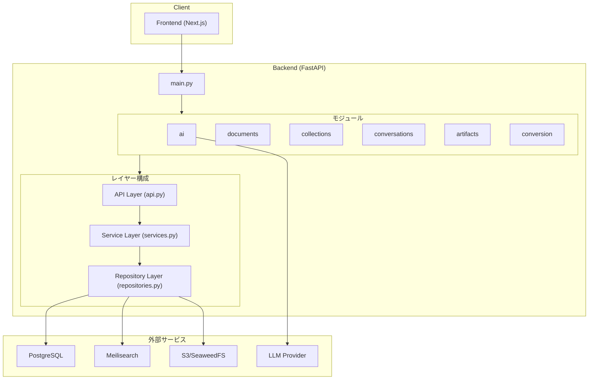
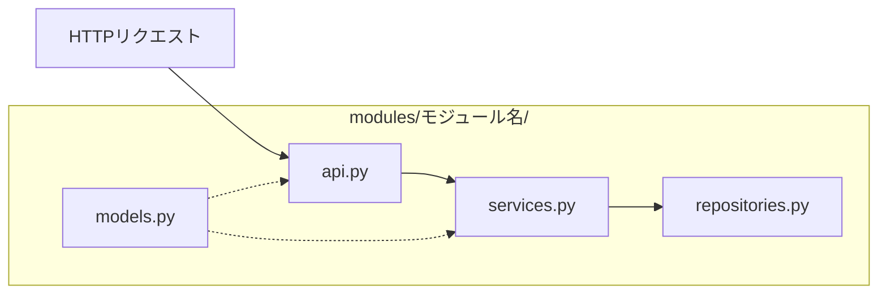
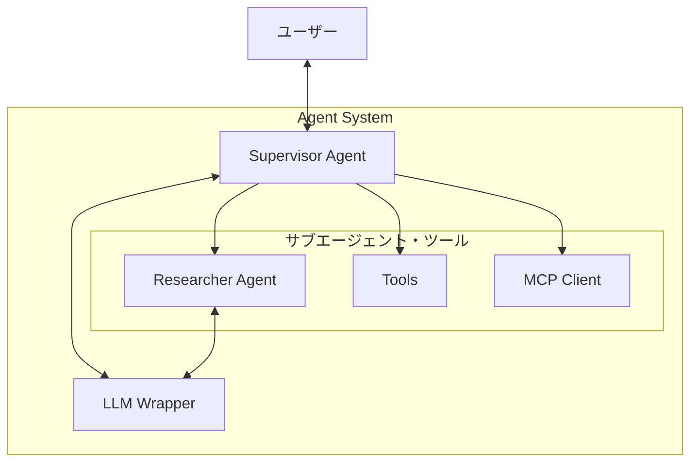
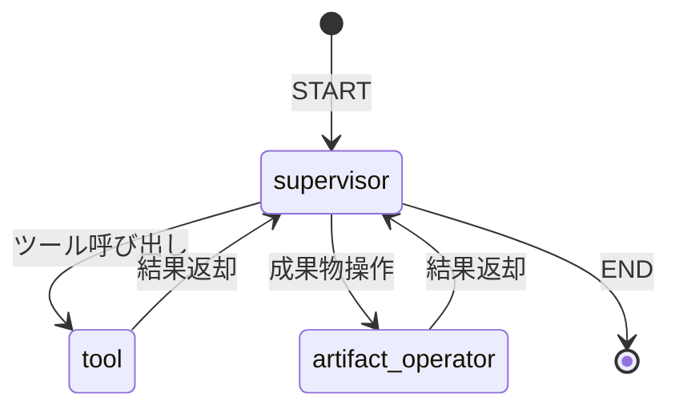
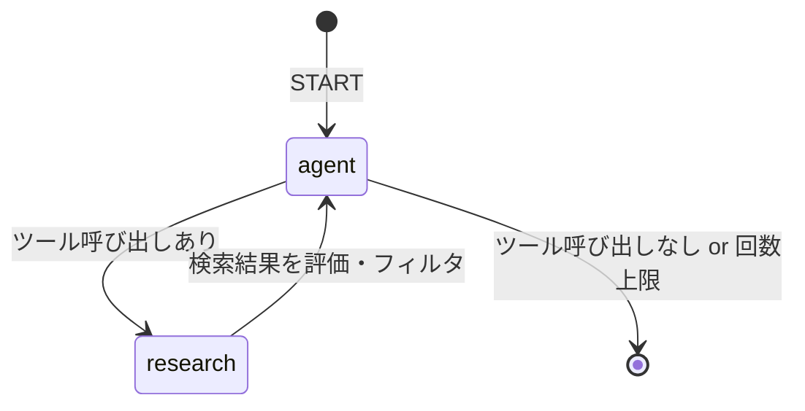

# QINeS GAI Backend

AUTOSAR関連ドキュメントに対するQ&A・AI支援機能を提供するAPIサーバーです。

## 全体アーキテクチャ



## ディレクトリ構成

```
backend/
├── src/qines_gai_backend/
│   ├── main.py                    # アプリケーションエントリポイント
│   ├── file_uploader.py           # AUTOSAR PDFアップロードCLI（開発用）
│   ├── logger_config.py           # ロガー設定
│   │
│   ├── config/                    # 設定関連ファイル
│   │   ├── dependencies/          # DI設定
│   │   │   ├── data_connection.py # DB/検索/S3接続管理
│   │   │   ├── repositories.py    # リポジトリのDI
│   │   │   └── services.py        # サービスのDI
│   │   └── external_resources/    # 外部リソース
│   │       ├── connections.py     # 接続管理
│   │       ├── postgresql.py      # PostgreSQL設定
│   │       └── meilisearch.py     # Meilisearch設定
│   │
│   ├── modules/                   # 機能モジュール群
│   │   ├── ai/                    # AI・LLM関連
│   │   ├── artifacts/             # 成果物管理
│   │   ├── collections/           # コレクション管理
│   │   ├── conversations/         # 会話管理
│   │   ├── conversion/            # 成果物→ドキュメント変換
│   │   └── documents/             # ドキュメント管理
│   │
│   ├── schemas/                   # DBスキーマ定義
│   │   └── schema.py              # SQLAlchemy ORMモデル
│   │
│   └── shared/                    # 共通ユーティリティ
│       ├── exceptions.py          # カスタム例外
│       ├── verify_token.py        # JWT検証
│       ├── storage_controller.py  # S3操作ヘルパー
│       └── ...
│
├── tests/                         # テストコード
├── pyproject.toml                 # 依存関係・プロジェクト設定
└── Dockerfile                     # コンテナビルド定義
```

## モジュール概要

### 機能別モジュール

| モジュール | 役割 |
|-----------|------|
| `ai` | LLMとの連携・AIエージェントによる検索・対話機能 |
| `documents` | ドキュメントのアップロード・検索・削除 |
| `collections` | ドキュメントの論理コレクション単位での管理 |
| `conversations` | ユーザーとAIの会話履歴管理 |
| `artifacts` | AIが生成した成果物（レポート等）の管理 |
| `conversion` | 成果物から新規ドキュメントへの変換処理 |

### ドキュメントの保存先

アップロードされたドキュメントは以下の3箇所に保存されます：

| 保存先 | 内容 |
|--------|------|
| S3/SeaweedFS | ファイル実体（オリジナルファイル） |
| Meilisearch | チャンク分割されたテキスト（全文検索用インデックス） |
| PostgreSQL | メタデータ（ファイル名、パス、サイズ、アップローダー等） |

削除時はこの3箇所すべてからデータが削除されます。

### モジュール構成

各モジュールは以下の構成で統一されています：



## AIエージェントアーキテクチャ



### Supervisor Agent ワークフロー



### Researcher Agent ワークフロー

Meilisearch検索とドキュメント評価を繰り返し、目標達成に必要な情報を収集します。



- **agent**: LLMが目標に基づいて検索クエリを生成
- **research**: Meilisearch検索を実行し、結果を`_grade_documents`で評価・フィルタリング
- ツール実行回数の上限（デフォルト10回）に達するか、LLMが十分な情報を得たと判断したら終了

### 主要コンポーネント

| コンポーネント | ファイル | 役割 |
|--------------|---------|------|
| Supervisor Agent | `agents/supervisor.py` | ユーザー対話の司令塔・ツール呼び出し判断 |
| Researcher Agent | `agents/researcher.py` | コレクション内ドキュメントの検索・調査 |
| Init Collection Agent | `agents/init_collection_agent.py` | コレクション作成時のドキュメント処理 |
| LLM Wrapper | `llm_wrapper/wrapper.py` | OpenAI/Azure/Ollama各LLMプロバイダーの抽象化 |
| MCP Client | `mcp_client.py` | Model Context Protocol連携 |
| Tools | `tools.py` | エージェントが使用するツール群 |

### AIエージェントツール一覧

| ツール名 | 説明 |
|---------|------|
| `create_artifact` | 新規成果物の作成 |
| `edit_artifact` | 既存成果物の編集・影響範囲分析 |
| `get_artifact` | 成果物の取得 |
| `get_document` | ドキュメントの取得・成果物変換 |
| `list_documents_in_collection` | コレクション内ドキュメント一覧 |
| `generate_test_case` | テストケース自動生成 |
| `research_agent` | ドキュメント検索・調査 |


## 開発コマンド

コンテナ内で実行すること

### テスト実行

```bash
# 全テスト実行
poetry run pytest

# カバレッジ付き
poetry run pytest --cov

# 特定テストのみ
poetry run pytest tests/test_specific.py -v
```

### テスト方針

| モジュール | カバレッジ目標 | 備考 |
|-----------|---------------|------|
| `modules/` 全般 | C0 100% | 基本的にすべてのコードパスをテストする |
| `modules/ai/` | ベストエフォート | AIエージェント部分はLLMの非決定性によりテストが困難なため |

**補足:**
- `ai` モジュール以外の `modules/` 配下は、C0カバレッジ100%を目標とする
- `ai` モジュールはLLMとの連携部分が多く、出力の再現性がないためテスト網羅が難しい。可能な範囲でユニットテスト・モック化を行うが、完全なカバレッジは求めない

### コード品質

```bash
# フォーマット
poetry run ruff format .
```

### AUTOSAR PDFアップロード（開発効率化ツール）

> **注意**: このツールは開発・検証用であり、AUTOSAR仕様書PDF専用です。
> PDFのメタデータやファイル名からAUTOSAR固有の情報（Web Doc Type等）を抽出するため、
> 他のPDFドキュメントには対応していません。

```bash
# Dockerコンテナ内で実行する必要があります
docker compose exec backend poetry run python3 \
  src/qines_gai_backend/file_uploader.py \
  --target_dir /path/to/autosar/pdfs

# オプション
#   --append       既存インデックスに追加（指定なしでリセット）
#   --s3_bucket    S3バケット名（デフォルト: qines-gai-local）
#   --concurrency  並列処理数（デフォルト: 4）
#   --batch_size   Meilisearchバッチサイズ（デフォルト: 500）
```

## 環境変数

環境変数の設定は、infraリポジトリの `conf/.env.backend.template` を参照してください。

## トラブルシューティング

### ログ出力

ログは `logger_config.py` で設定されています。
関数単位のログ出力には `@log_function_start_end` デコレータを使用してください。
