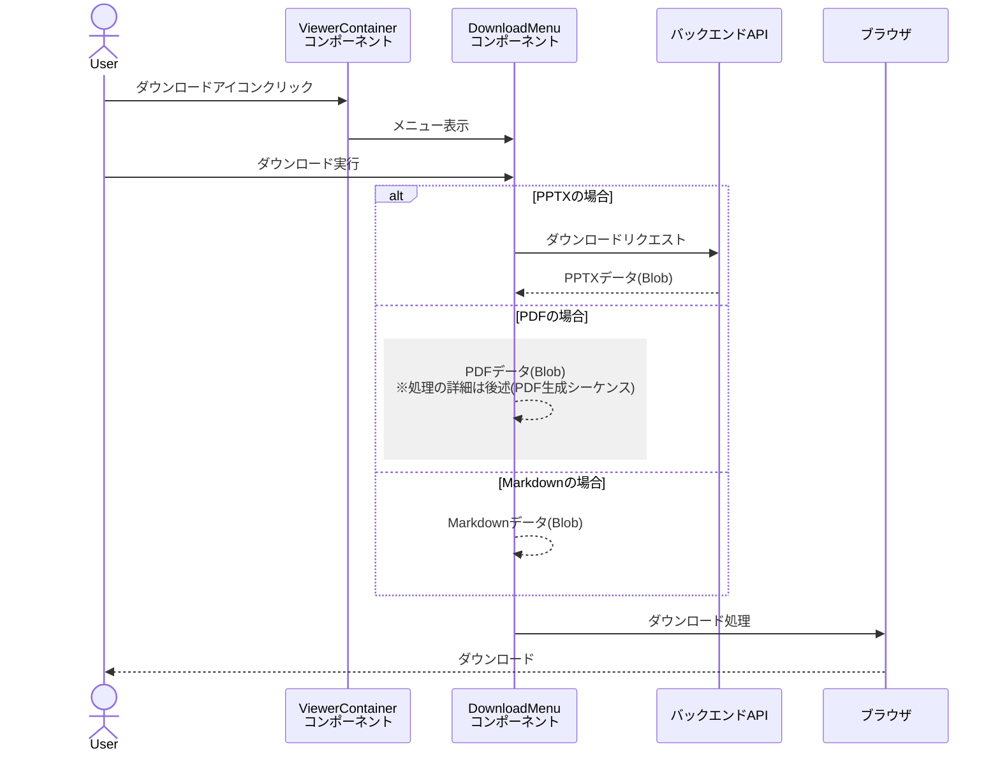
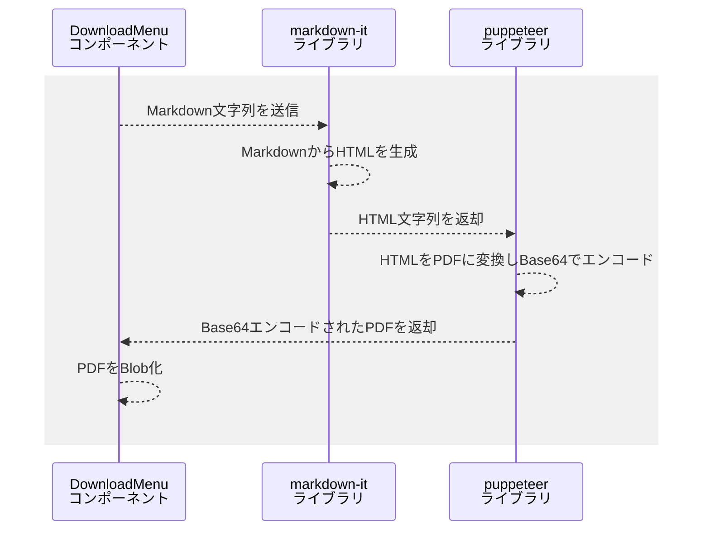

# 成果物ダウンロードに関するシーケンス

## シーケンス図

### メインシーケンス

```mermaid
sequenceDiagram
    actor User
    participant ViewerContainer as ViewerContainer<br>コンポーネント
    participant DownloadMenu as DownloadMenu<br>コンポーネント
    participant バックエンドAPI
    participant ブラウザ

    User->>ViewerContainer: ダウンロードアイコンクリック
    ViewerContainer->>DownloadMenu: メニュー表示
    User->>DownloadMenu: ダウンロード実行
    alt PPTXの場合
        DownloadMenu->>バックエンドAPI: ダウンロードリクエスト
        バックエンドAPI-->>DownloadMenu: PPTXデータ(Blob)
    else PDFの場合
        rect rgb(240, 240, 240)
            DownloadMenu-->>DownloadMenu: PDFデータ(Blob)<br />※処理の詳細は後述(PDF生成シーケンス)
        end
    else Markdownの場合
        DownloadMenu-->>DownloadMenu: Markdownデータ(Blob)
    end
    DownloadMenu->>ブラウザ: ダウンロード処理
    ブラウザ-->>User: ダウンロード
```

### PDF生成シーケンス

```mermaid
sequenceDiagram
    participant DownloadMenu as DownloadMenu<br>コンポーネント
    participant markdown-it as markdown-it<br>ライブラリ
    participant puppeteer as puppeteer<br>ライブラリ

    rect rgb(240, 240, 240)
        DownloadMenu-->>markdown-it: Markdown文字列を送信
        markdown-it-->>markdown-it: MarkdownからHTMLを生成
        markdown-it-->>puppeteer: HTML文字列を返却
        puppeteer-->>puppeteer: HTMLをPDFに変換しBase64でエンコード
        puppeteer-->>DownloadMenu: Base64エンコードされたPDFを返却
        DownloadMenu-->>DownloadMenu: PDFをBlob化
    end
```
