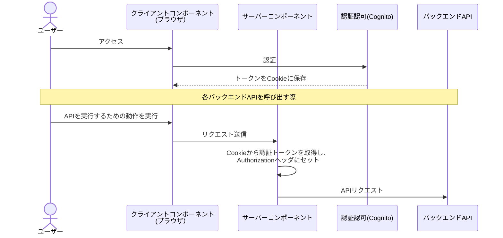

# ログインに関するシーケンス

## シーケンス図

```mermaid
sequenceDiagram
  actor User as ユーザー
  participant Browser as クライアントコンポーネント<br>(ブラウザ）
  participant ServerComponent as サーバーコンポーネント
  participant Auth as 認証認可(Cognito)
  participant Backend as バックエンドAPI

  User->>Browser: アクセス
  Browser->>Auth: 認証
  Auth-->>Browser: トークンをCookieに保存

  Note over User,Backend: 各バックエンドAPIを呼び出す際
  User->>Browser: APIを実行するための動作を実行
  Browser->>ServerComponent: リクエスト送信
  ServerComponent->>ServerComponent: Cookieから認証トークンを取得し、<br />Authorizationヘッダにセット
  ServerComponent->>Backend: APIリクエスト
```
