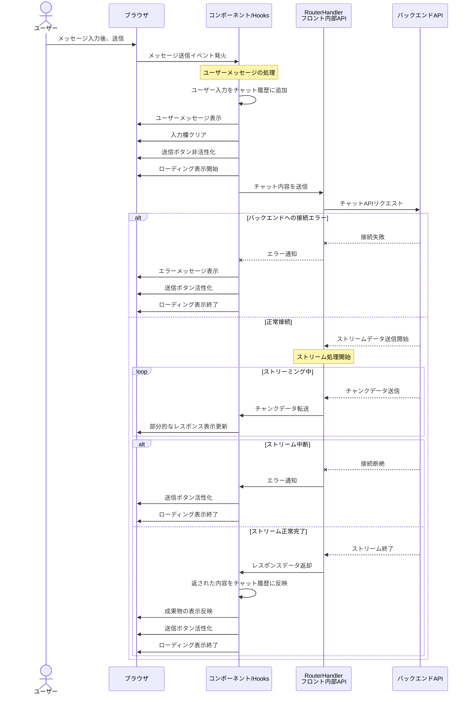

# チャットに関するシーケンス

## シーケンス図

```mermaid
sequenceDiagram
  actor User as ユーザー
  participant Browser as ブラウザ
  participant FrontLogic as コンポーネント/Hooks
  participant InternalAPI as RouterHandler<br>フロント内部API
  participant BackendAPI as バックエンドAPI

  User->>Browser: メッセージ入力後、送信

  Browser->>FrontLogic: メッセージ送信イベント発火

  Note over FrontLogic: ユーザーメッセージの処理
  FrontLogic->>FrontLogic: ユーザー入力をチャット履歴に追加
  FrontLogic->>Browser: ユーザーメッセージ表示
  FrontLogic->>Browser: 入力欄クリア
  FrontLogic->>Browser: 送信ボタン非活性化
  FrontLogic->>Browser: ローディング表示開始

  FrontLogic->>InternalAPI: チャット内容を送信

  InternalAPI->>BackendAPI: チャットAPIリクエスト

  alt バックエンドへの接続エラー
      BackendAPI--xInternalAPI: 接続失敗
      InternalAPI--xFrontLogic: エラー通知
      FrontLogic->>Browser: エラーメッセージ表示
      FrontLogic->>Browser: 送信ボタン活性化
      FrontLogic->>Browser: ローディング表示終了
  else 正常接続
      BackendAPI-->>InternalAPI: ストリームデータ送信開始

      Note over InternalAPI: ストリーム処理開始

      loop ストリーミング中
          BackendAPI-->>InternalAPI: チャンクデータ送信
          InternalAPI->>FrontLogic: チャンクデータ転送
          FrontLogic->>Browser: 部分的なレスポンス表示更新
      end

      alt ストリーム中断
          BackendAPI--xInternalAPI: 接続断絶
          InternalAPI->>FrontLogic: エラー通知
          FrontLogic->>Browser: 送信ボタン活性化
          FrontLogic->>Browser: ローディング表示終了
      else ストリーム正常完了
          BackendAPI-->>InternalAPI: ストリーム終了
          InternalAPI->>FrontLogic: レスポンスデータ返却

          FrontLogic->>FrontLogic: 返された内容をチャット履歴に反映
          FrontLogic->>Browser: 成果物の表示反映
          FrontLogic->>Browser: 送信ボタン活性化
          FrontLogic->>Browser: ローディング表示終了
      end
  end
```
