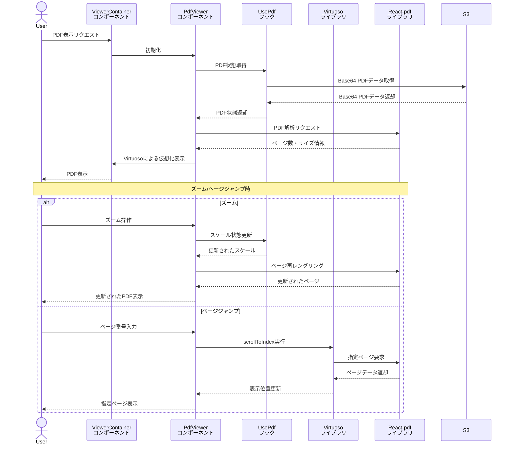

# PDFプレビューに関するシーケンス

## シーケンス図

```mermaid
sequenceDiagram
    actor User
    participant ViewerContainer as ViewerContainer<br>コンポーネント
    participant PdfViewer as PdfViewer<br>コンポーネント
    participant UsePdf as UsePdf<br>フック
    participant Virtuoso as Virtuoso<br>ライブラリ
    participant React-pdf as React-pdf<br>ライブラリ
    participant S3


    User->>ViewerContainer: PDF表示リクエスト
    ViewerContainer->>PdfViewer: 初期化
    PdfViewer->>UsePdf: PDF状態取得
    UsePdf->>S3: Base64 PDFデータ取得
    S3-->>UsePdf: Base64 PDFデータ返却
    UsePdf-->>PdfViewer: PDF状態返却
    PdfViewer->>React-pdf: PDF解析リクエスト
    React-pdf-->>PdfViewer: ページ数・サイズ情報
    PdfViewer->>ViewerContainer: Virtuosoによる仮想化表示
    ViewerContainer-->>User: PDF表示

    Note over User,React-pdf: ズーム/ページジャンプ時
    alt ズーム
        User->>PdfViewer: ズーム操作
        PdfViewer->>UsePdf: スケール状態更新
        UsePdf-->>PdfViewer: 更新されたスケール
        PdfViewer->>React-pdf: ページ再レンダリング
        React-pdf-->>PdfViewer: 更新されたページ
        PdfViewer-->>User: 更新されたPDF表示
    else ページジャンプ
        User->>PdfViewer: ページ番号入力
        PdfViewer->>Virtuoso: scrollToIndex実行
        Virtuoso->>React-pdf: 指定ページ要求
        React-pdf-->>Virtuoso: ページデータ返却
        Virtuoso-->>PdfViewer: 表示位置更新
        PdfViewer-->>User: 指定ページ表示
    end
```
